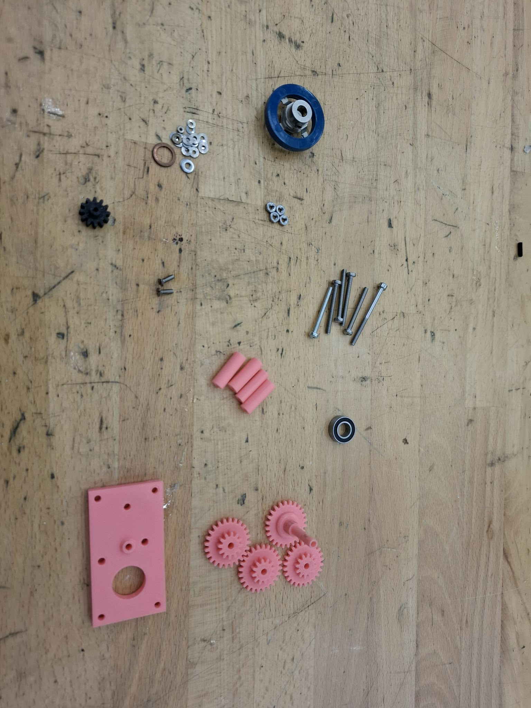

## Materials

The following materials and tools are required to assemble the setup:

| Material |
|---|
| 3D-printed parts | 
| M3 bolts | 
| M2.5 bolts |   
| Flat metal washers |  
| Hex nuts | 
| Motor |   
| Power supply | 
| Spinning plate |  
| Drill | 

A photograph of all required materials is shown below.

